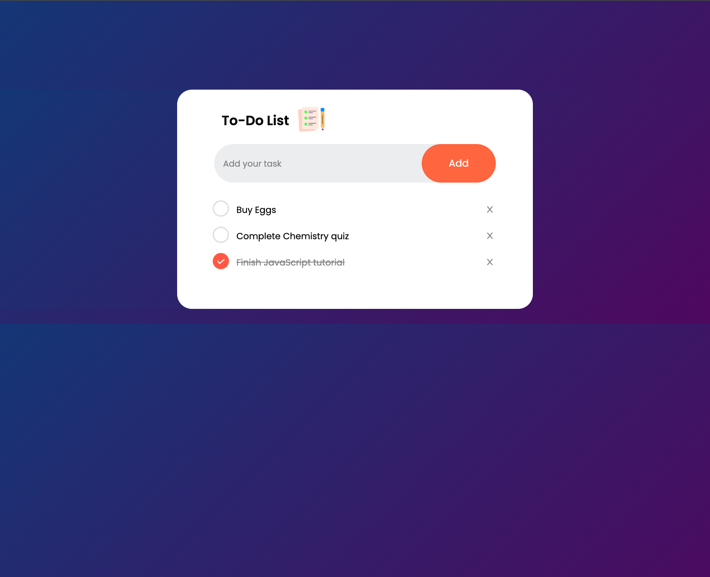

# 📝 To-Do List App

A simple and elegant To-Do List web application built using **HTML, CSS, and JavaScript**.  
This app allows users to add, complete, and delete tasks with data stored in **localStorage** so tasks persist even after refreshing the page.

---

## 🚀 Features

- ➕ Add new tasks
- ✅ Mark tasks as completed
- ❌ Delete tasks
- 💾 Persistent storage using localStorage
- 🎨 Clean and modern UI
- 📱 Responsive design

---

## 📸 Preview



---

## 🛠️ Tech Stack

- **HTML5**
- **CSS3**
- **JavaScript (Vanilla JS)**
- **LocalStorage API**
- **Font Awesome Icons**
- **Google Fonts (Poppins)**

---

## 📂 Project Structure

📦 Do-Do List

- ----- 📁 assets
- ---------- 📁 images
- ---------- icon.png
- ---------- checked.png
- ---------- unchecked.png
- ---------- preview.png # Add your screenshot here
- ----- index.html
- ----- style.css
- ----- script.js
- ----- README.md

---

## ⚙️ How to Run the Project

### 1. Clone the repository

```bash
git clone git@github.com:Codezzoom/To-Do-List.git
```

```bash
cd your-repository-name
```

- run through live server

## 📄 License

This project is open source and available under the MIT License.

## 👨‍💻 Author

GitHub: https://github.com/codezzoom
